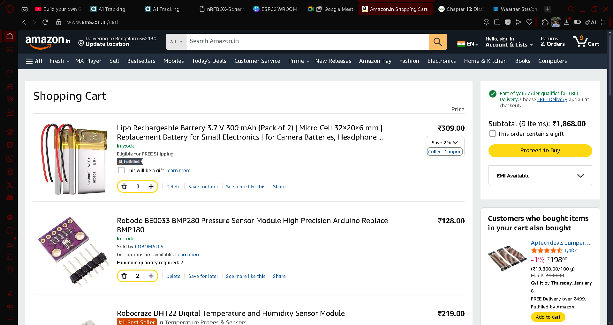

# Weather Station

## Overview
A comprehensive weather monitoring system that measures temperature, humidity, pressure, and other atmospheric conditions.

## Features
- Real-time temperature and humidity monitoring
- Atmospheric pressure measurement
- Data logging and storage
- User-friendly interface

## Hardware Requirements

### Bill of Materials (BOM)
| Component | Quantity | Notes |
|-----------|----------|-------|
| Microcontroller | 1 | ESP32 or Arduino |
| DHT22 Sensor | 1 | Temperature & Humidity |
| BMP280 Sensor | 1 | Pressure & Altitude |
| Power Supply | 1 | 5V USB or Battery |
| Resistors | 2 | 7.4kΩ pull-up |
| Raindrops sensor | 1 | Raindrops |
| PCB/Breadboard | 1 | For assembly |
| Connectors | 1 | Jumper wires & headers |
## BOM

## Schematic


## Installation
1. Assemble hardware according to schematic
2. Flash firmware to microcontroller
3. Connect to power supply
4. Monitor via serial interface or web dashboard

## Usage
```bash
# Serial monitoring example
screen /dev/ttyUSB0 115200
```

## License
See LICENSE file for details.
